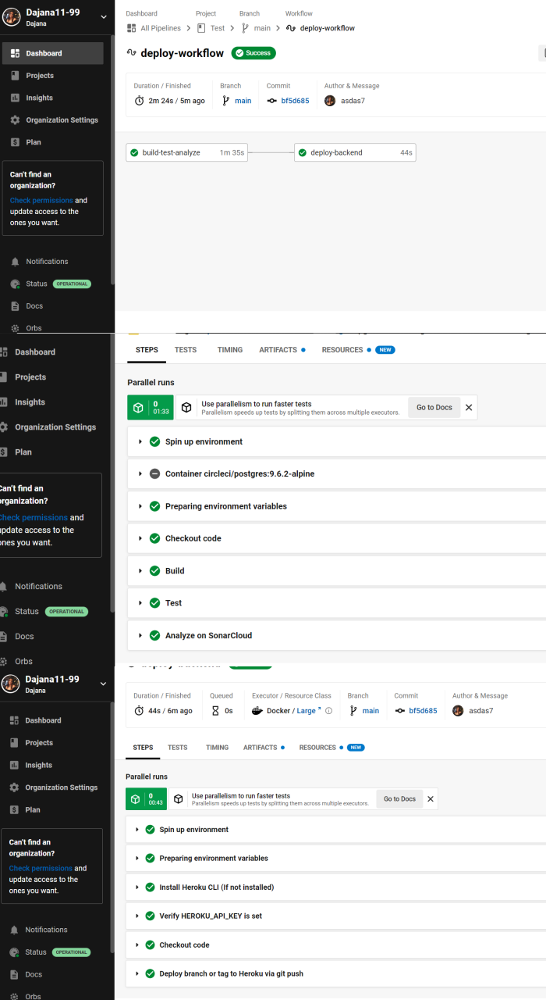

[](https://sonarcloud.io/summary/new_code?id=Dajana11-99_ISA-FishingBooker)

# Fisherman

### Heroku
Backend: [](https://ancient-cliffs-65079.herokuapp.com/)

Frontend: [](https://rocky-ravine-63735.herokuapp.com/)

## Description

Web application for booking fishing cabins, boats and trips. Full stack academic project made for course Internet Software Architectures at Faculty of Technical Sciences, Novi Sad.

|       Student 1       |       Student 2       |       Student 3       |   
|:----------------------:|:----------------------:|:----------------------:|
| [Aleksa Stojic RA83/2018](https://github.com/stojic19) <br>  | [Magdalena Reljin RA82/2018](https://github.com/magdalenaRA822018) <br>  | [Dajana Zlokapa RA240/2018](https://github.com/Dajana11-99) <br>  |

## Table of Contents
- [Built_with](#built_with)
- [Installation](#installation)
- [Usage](#usage)
- [DevOps_microflow](#devops_microflow)

## Built_with
- Backend: java + Spring Boot [JDK 11.0.12, SDK 14.0.2]
- Frontend: Vue js x3, Bootstrap
- Persistence: PostgreSQL,Firebase

## Installation

1. Clone the repo
   ```sh
   git clone https://github.com/Dajana11-99/ISA-FishingBooker
   ```
2. Starting frontend - open cmd in frontend directory and run:
   ```sh
   npm install
   ```
   ```sh
   npm run serve
   ```
3. Starting PostgreSQL
   - In PGAdmin create database: fishermandb
   
4. Starting backend locally - setup JDK and run

## Usage
Roles and credentials:
- Client - username: cl@gmail.com, password: 123
- Cabin Owner - username: co@gmail.com, password: 123
- Boat Owner - username: bo@gmail.com, password: 123
- Fishing instructor - username: fi@gmail.com, password: 123
- Predefined admin - username: dajanazlokapa1@gmail.com, password: 123
- Admin - username: proba@gmail.com, password: 123

## DevOps_microflow



